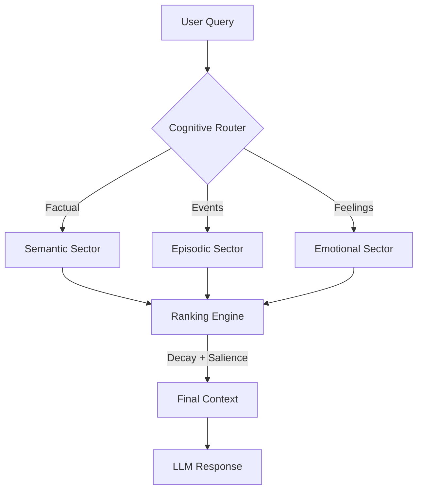

# Introduction to OpenMemory

OpenMemory is a production-ready **long-term memory system** designed specifically for AI agents and conversational systems. It implements the **HMD v2 (Holistic Memory Descriptor v2) specification** with advanced features like multi-sector embeddings, time-based decay, and graph-based waypoints.

## Why OpenMemory?

Most "memory" solutions are just vector databases wrapped in a Python script. OpenMemory is different. It is a **Cognitive Engine**.

### The Problem: Stateless AI
Modern AI assistants have amnesia. They forget everything the moment the session ends.
- **No Continuity**: Every chat starts from zero.
- **No Learning**: They repeat the same mistakes.
- **High Cost**: Re-sending context tokens is expensive.

### The Solution: A Living Brain
OpenMemory gives your agent a persistent, evolving brain that lives on your local machine.

1.  **Local-First**: Runs inside your app (Node.js/Python). No external API calls required.
2.  **Temporal**: Understands time. Knows that "current CEO" changes over time.
3.  **Multi-Sector**: Stores memories in 5 distinct sectors (Episodic, Semantic, Procedural, Emotional, Reflective).
4.  **Adaptive Decay**: Important memories stick; trivial ones fade.

## Key Features

- **⚡ Standalone Mode**: `npm install openmemory-js`. No Docker. No Server.
- **🕸️ Temporal Knowledge Graph**: Tracks facts like `(User, location, New York, 2023-2024)`.
- **🧠 5-Sector Embeddings**: Context-aware retrieval based on *why* you are asking.
- **🔌 MCP Support**: Plug-and-play with Claude Desktop and Cursor.

## How it Works

## Get Started

Ready to give your agent a brain?

- **[Quick Start](/docs/quick-start)**: Up and running in 5 minutes.
- **[Standalone Mode](/docs/standalone)**: Learn about the local-first architecture.
- **[Examples](/docs/examples)**: Copy-paste code snippets.
